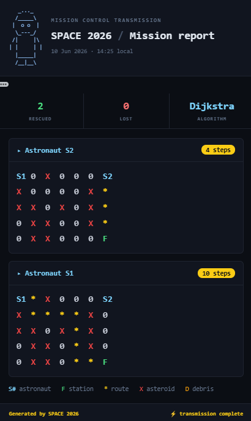
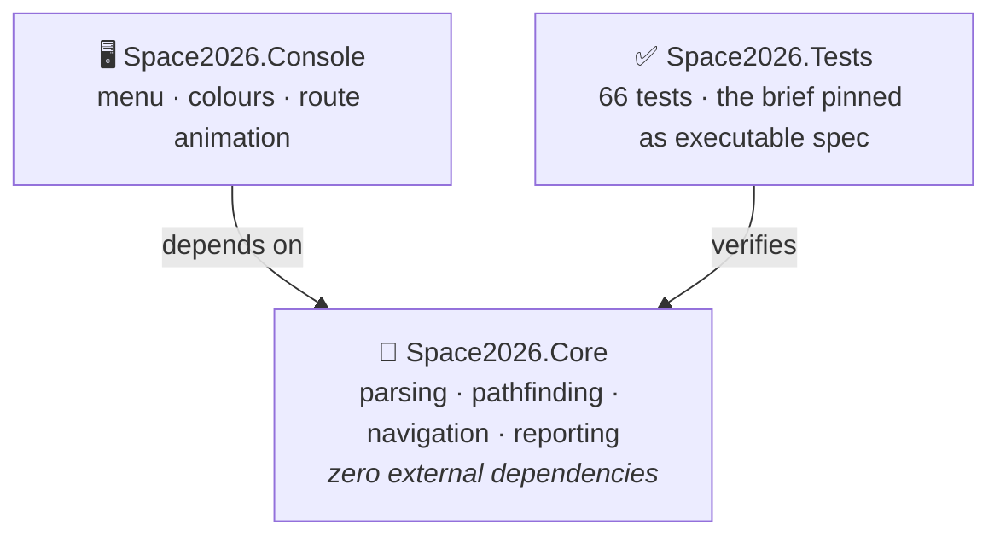
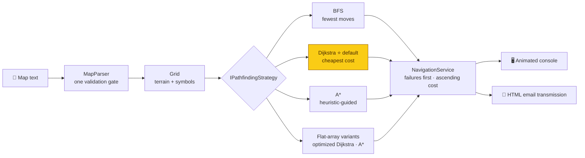
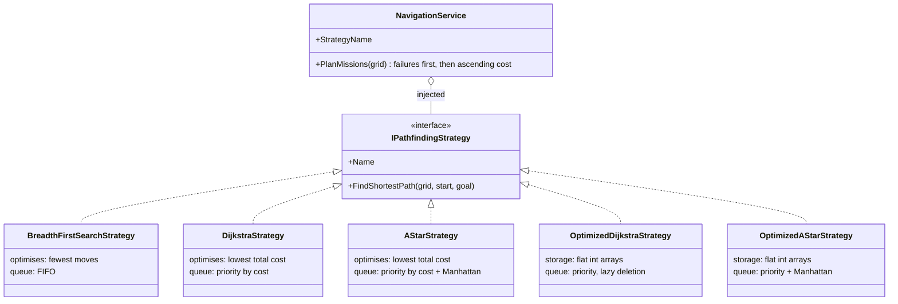

<div align="center">

# 🚀 SPACE 2026 - Astronaut Navigation

[](https://github.com/RayaSergieva/space-2026/actions/workflows/ci.yml)


*Guiding astronauts home, one shortest path at a time.*

</div>

```text
   _..._
  /_____\
 |  o o  |     "Mission control, this is S1.
  \_---_/       Requesting cheapest route home."
 /|     |\
| |     | |
  |_____|
  /__|__\
```

A C# / .NET 10 console application that guides stranded astronauts across a
cosmic map to the Space Station by the cheapest possible route - avoiding
asteroids and paying double to push through space debris.

Built for the Hitachi Solutions Europe technical assessment, with an emphasis
on clean architecture, test-driven correctness, and an honest commit history:
the repository was built incrementally, and the log reads as the story of the
design.

## 🎬 Demo

<!-- Record the console with ScreenToGif, save as docs/demo.gif, then uncomment:

-->

Run the sample mission and watch each route trace itself across the asteroid
field, star by star. Then answer `y` to the email prompt and the report
arrives as the mission-control transmission shown below.

## 🗺️ The mission

| Symbol | Meaning | Entry cost |
|:------:|---------|:----------:|
| 🟦 `S1` `S2` `S3` | Astronaut launch pods | start |
| 🟩 `F` | The Space Station (goal) | 1 |
| ⬜ `O` / `0` | Open space | 1 |
| 🟥 `X` | Asteroid | impassable |
| 🟨 `D` | Space debris | 2 |

For every astronaut the app finds the cheapest route to `F`, draws it on the
map with `*`, and reports results exactly as the brief requires: failures on
top, then successes in ascending order of path cost.

## ⚡ Quick start

Requires the .NET 10 SDK.

```bash
dotnet run --project Space2026.Console   # run the app
dotnet test                              # run all 66 tests
```

Or open `Space2026.slnx` in Visual Studio 2026 and run `Space2026.Console`.

### What the menu offers

1. **Run the sample mission** - the exact map from the assessment brief,
   solved and animated. Start here.
2. **Load a map from a file** - point it at any text file with one row of
   space-separated symbols per line (a ready-made map ships at
   `Space2026.Console/Maps/sample.txt`).
3. **Enter a map manually** - declare M and N, then type the rows; every
   mission rule is validated with a message naming the exact problem.
4. **Generate a random map** - choose size, astronaut count and obstacle
   densities; generation re-rolls until astronaut S1 has a guaranteed route.
5. **Choose algorithm** - swap between five implementations (BFS, Dijkstra,
   A*, and the flat-array optimized pair) at runtime and watch them agree
   (or, on debris, disagree) about the route.
6. **Benchmark the algorithms** - times all five on a seeded 100x100 map and
   prints a comparison table (see Performance below).
7. **Exit** - over and out.

After every mission the app offers to email the report - see below.

## 📧 Emailing the mission report

After each mission the app asks:

```text
Email this report to mission control? (y/N):
```

Answer `y` and it prompts for three inputs, then delivers the report over
SMTP (TLS, port 587) as a styled HTML "mission transmission":

<div align="center">



</div>

The email carries the same facts as the console - failures first, then each
journey with its cost badge and colour-coded map - plus a rescued/lost/
algorithm stats strip and a legend.

### 🔐 A note on the password prompt

When you type the password, **nothing appears on screen - not even
asterisks**. That is deliberate: the input is read keystroke-by-keystroke
with echo suppressed (`Console.ReadKey(intercept: true)`), so the secret
never appears in the terminal, in scrollback, or in a screen recording.
Backspace works; the password lives only in memory for the one send.

### Using Gmail as the sender

Google blocks regular account passwords for SMTP - you need an
**app password** (a 16-character code Google generates for exactly this):

1. Google Account → **Security** → make sure **2-Step Verification** is on
2. Open <https://myaccount.google.com/apppasswords>
3. Create one (name it anything, e.g. `space-2026`) and copy the code
4. In the app: sender = your Gmail address, password = the app password,
   receiver = any address (sending to yourself is the easiest demo)

Other providers work too - the SMTP host and port have sensible defaults for
Gmail and can be changed in `EmailMissionReporter`. If anything fails
(wrong credentials, no network), the app reports the server's reason in one
line and returns to the menu - a failed transmission never crashes the
mission.

## 🧠 Architecture



`Space2026.Core` knows nothing about the console. Parsing, pathfinding,
ordering, rendering and reporting are separate concerns with one
responsibility each - which is what makes the algorithm swappable and a
future UI (web, desktop) a new project rather than a rewrite.

## 🧭 The pathfinding pipeline



Five interchangeable algorithms sit behind one interface and can be swapped
from the menu at runtime:

| Algorithm | Optimises | What distinguishes it |
|-----------|-----------|-----------------------|
| Breadth-First Search | fewest **moves** | the right tool only when step costs are uniform (no debris) |
| Dijkstra ⭐ | lowest **total cost** | weighted terrain - the default |
| A* | lowest total cost | same answer, guided by an admissible Manhattan heuristic so it explores far fewer cells |
| Dijkstra (optimized, flat arrays) | lowest total cost | same exploration, cheaper visits - int-indexed arrays replace hashed collections |
| A* (optimized, flat arrays) | lowest total cost | both levers combined - see Performance for the honest, measured result |

The difference is not academic. On this corridor, the straight route crosses
three debris cells while a longer detour stays in open space:

```text
S1 D D D F      straight through: 4 moves, total cost 7   (BFS picks this)
0  0 0 0 0      detour below:     6 moves, total cost 6   (Dijkstra picks this)
```

A test pins both outcomes, documenting in executable form why Dijkstra is the
default once debris exists.

## 📊 Performance

Menu option 6 benchmarks all five strategies on the same seeded 100x100 map
(25% asteroids, 10% debris), 200 timed runs each after a JIT warm-up.
Measured on the author's machine (.NET 10, Windows):

```text
Algorithm                              Avg / run   Speed vs Dijkstra   Path cost
Breadth-First Search                    2551.7 us             1.48x          62
Dijkstra (weighted)                     3766.9 us             1.00x          62
A* (weighted, heuristic-guided)          610.3 us             6.17x          62
Dijkstra (optimized, flat arrays)       1745.8 us             2.16x          62
A* (optimized, flat arrays)             1228.1 us             3.07x          62
```

Three readings worth taking from the table:

- **Every weighted strategy found the identical cost-62 route.** The
  optimisations change the speed, never the answer - the cross-strategy
  equivalence tests pin this, and the benchmark confirms it at scale.
- **The two speed-ups are different levers.** The Manhattan heuristic prunes
  the search (6.17x, by exploring far fewer cells); flat arrays make each
  visit cheaper (2.16x, by replacing hashed collections with int-indexed
  array reads).
- **Combining them did not simply multiply.** The flat variants pay a fixed
  per-call setup cost (building the 10,000-entry cost arrays before
  searching), and on a heuristic-pruned search that tax outweighs part of
  the savings - so plain A* remains the single-query champion here. Fewer
  operations beat cheaper operations: a measured finding, not a guess. The
  known fix is to cache the flat cost array on the `Grid` so it is built
  once per map instead of once per query - left as the documented next rung.

Figures are indicative `Stopwatch` averages; BenchmarkDotNet is the rigorous
tool for production-grade measurement.

## 🎨 Design decisions worth noting

- **Strategy pattern + constructor injection.** `NavigationService` receives
  its `IPathfindingStrategy`; swapping algorithms changes one line and zero
  logic. Adding a fourth algorithm is one new class and one menu entry.
- **`readonly record struct Position`.** Value equality and zero heap
  allocation for the type created most often in the pathfinding hot loop.
- **One validation gate.** Anything that parses into a `Grid` is valid by
  construction; nothing downstream re-checks. User mistakes raise
  `MapValidationException` and surface as friendly one-line messages - bugs
  still fail loudly.
- **Terrain and symbols stored separately.** Pathfinding reads terrain; the
  renderer echoes the original glyphs, so a map written with `0` renders back
  with `0` - byte-for-byte fidelity to the input.
- **`O` and `0` both accepted.** The brief's legend defines open space as the
  letter `O` while its worked example uses the digit `0`; the parser accepts
  both (case-insensitively) and preserves whichever glyph the author wrote -
  a documented decision on a spec ambiguity rather than a silent guess.
- **The brief as a test fixture.** The worked example's costs (S2 = 4,
  S1 = 10) and annotated maps are pinned in tests, so any deviation from the
  specification is a red build, not an opinion.
- **Email via `System.Net.Mail`** keeps the dependency count at zero; MailKit
  is the noted production replacement.

## 🏆 Bonus objectives

- ✅ **Space debris** - weighted pathfinding via Dijkstra / A*
- ✅ **Swappable algorithms** - Strategy pattern, five implementations,
  switchable at runtime
- ✅ **Random map generation** - seedable, with guaranteed solvability for S1
- ✅ **Email report** - SMTP with a styled HTML "mission transmission"

## ✅ Tests



66 xUnit tests mirror Core's structure: parser rule-by-rule rejection
messages, the brief's example as a byte-for-byte rendering fixture,
cross-strategy equivalence (every weighted algorithm must agree on optimal
costs), agreement of both flat-array strategies with standard Dijkstra
across 20 seeded random maps each (including unsolvable ones), seeded
determinism and solvability for the random generator, and the
BFS-vs-Dijkstra debris contrast. CI runs the suite on every push.

## 🔭 Next steps

The flat-array optimisation promised by earlier versions of this document is
now built and benchmarked in-app (menu option 6). The remaining rungs on the
performance ladder, deliberately left unclimbed:

- **Cache the flat cost array on the `Grid`** - built once per map instead
  of once per query, erasing the setup tax the benchmark exposed.
- **Dial's algorithm** - with entry costs limited to {1, 2}, a bucket queue
  replaces the binary heap for O(E) total work.
- **BenchmarkDotNet** - statistically rigorous timing to replace the
  indicative Stopwatch figures.

Each would drop in behind the same `IPathfindingStrategy` interface - the
architecture was shaped so that performance work costs one new class, not a
rewrite.
